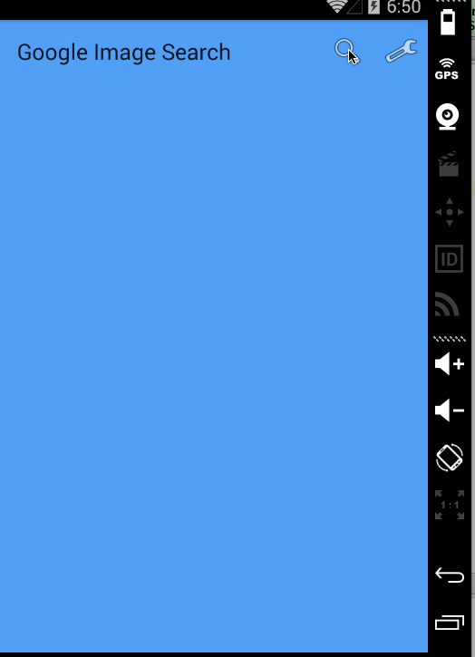

# Google Image Search
===========================

This is Simple image search

Time spent: 6 hours spent in total

Completed user stories:
-----------

* [x] Required: User can enter a search query that will display a grid of image results from the Google Image API.
* [ ] Required: User can click on "settings" which allows selection of advanced search options to filter results
* [ ] Required: User can configure advanced search filters such as:
			Size (small, medium, large, extra-large)
			Color filter (black, blue, brown, gray, green, etc...)
			Type (faces, photo, clip art, line art)
			Site (espn.com)
* [ ] Required: Subsequent searches will have any filters applied to the search results
* [x] Required: User can tap on any image in results to see the image full-screen
* [ ] Required: User can scroll down “infinitely” to continue loading more image results (up to 8 pages)
* [x] Optional: Advanced: Robust error handling, check if internet is available, handle error cases, network failures
* [ ] Optional: Advanced: Use the ActionBar SearchView or custom layout as the query box instead of an EditText
* [ ] Optional: Advanced: User can share an image to their friends or email it to themselves
* [ ] Optional: Advanced: Replace Filter Settings Activity with a lightweight modal overlay
* [ ] Optional: Advanced: Improve the user interface and experiment with image assets and/or styling and coloring
* [ ] Optional: Bonus: Use the StaggeredGridView to display improve the grid of image results
* [ ] Optional Bonus: User can zoom or pan images displayed in full-screen detail view
 
Walkthrough of all user stories:
-----------

GIF created with [LiceCap](http://www.cockos.com/licecap/).
